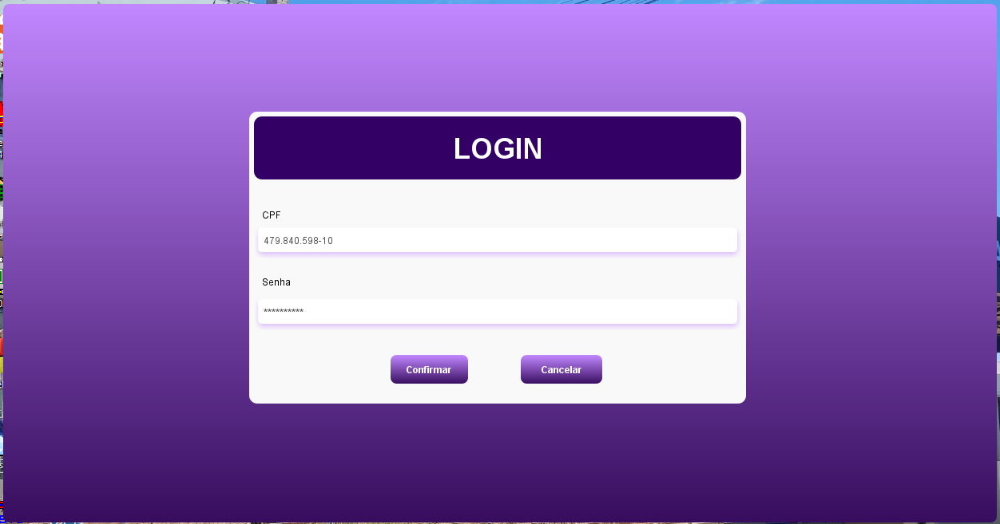
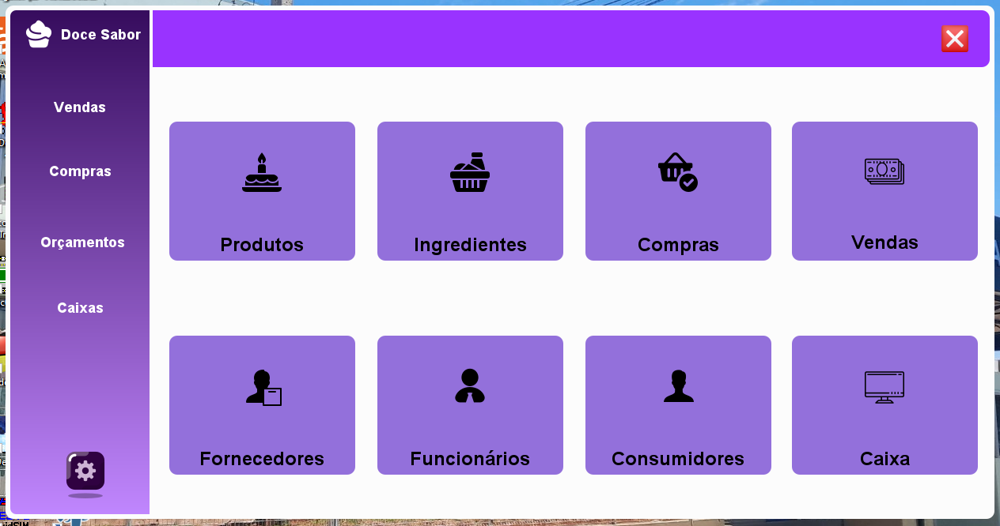
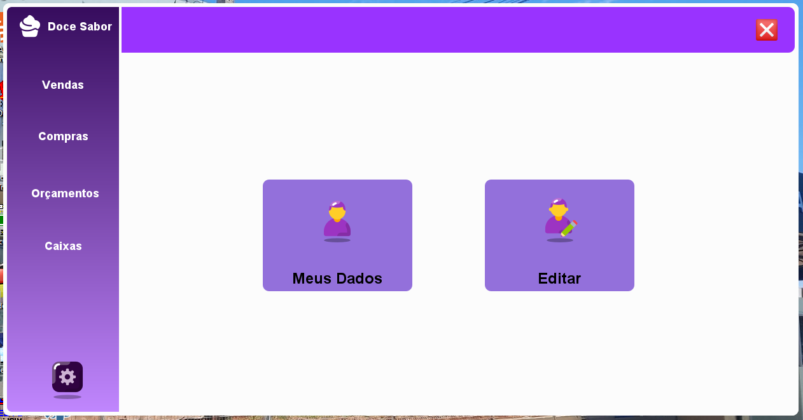
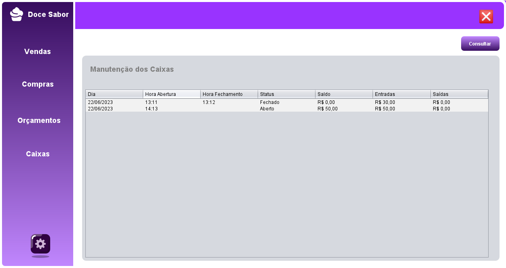
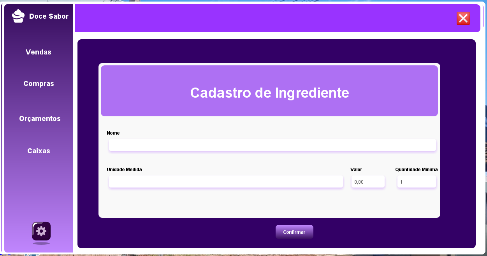
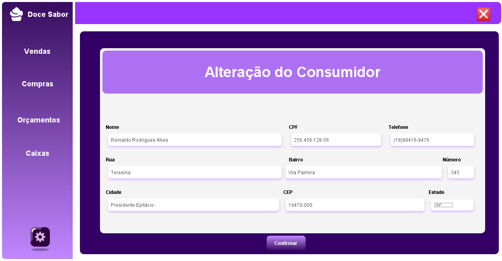
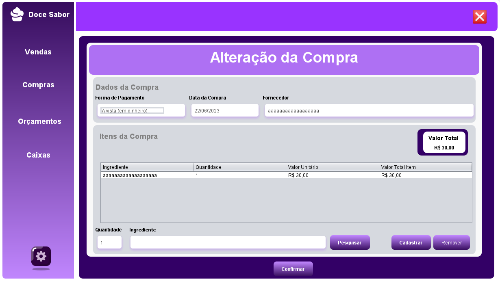

# **Confeitaria Doce Sabor**

A **"Doce Sabor"** é uma aplicação desktop desenvolvida em 2023. Ela foi implementada para auxiliar no gerenciamento de vendas, estoque, orçamento e produção diária de uma confeitaria fictícia. Esse sistema foi implementado na disciplina de **Projeto Integrador** no 3 ano do **curso técnico em informática**. Ela foi publicada na forma de resumo expandido e apresentado na **edição de 2023** da **Mostra Científica, Cultural e Tecnológica do Instituto Federal de Educação, Ciência e Tecnologia de São Paulo - Campus Presidente Epitácio**. Portal : [IFSP - PEP] (https://pep2.ifsp.edu.br/mct/index.php/resumos-expandidos).

#

## **Tecnologias Utilizadas:**
- **Java**;
- **JavaFX**;
- **JasperReports**;
- **MySQL**;
-  **IDE (Eclipse)**;

#

## **Funcionalidades Principais:**

### Cadastro e Gestão de Pedidos:
- O sistema permite que atendentes associem clientes a pedidos, incluindo itens a serem produzidos e datas de entrega. Após a produção, pedidos podem ser marcados como concluídos e estão disponíveis para retirada ou entrega.

### Controle de Produção e Consumo:
- Registro diário da produção de doces e salgados feito. Controle do consumo de matérias-primas. O estoque é atualizado automaticamente com as matérias-primas utilizadas, e requisições de novos produtos podem ser feitas conforme necessário.

### Gestão de Orçamentos e Vendas:
- Clientes podem solicitar orçamentos, que são registrados no sistema e podem ser aprovados posteriormente. Todas as transações financeiras, incluindo vendas e pagamentos, são registradas automaticamente. Atualização do estoque após cada venda.

### Gerenciamento de Funcionários e Fornecedores:
- Cadastro e manutenção de dados de funcionários e fornecedores.
- Controle de acessos com níveis diferenciados (administrador, atendente, cozinheira).

### Movimentações Financeiras:
- Registro de todas as entradas e saídas de dinheiro no caixa.
- Relatórios financeiros diários.

#

## **Níveis de Acesso:**

- ### Administrador: Gerencia dados dos funcionários e fornecedores, controla o fluxo de vendas e compra de ingredientes.
- ### Atendente: Registra e gerencia pedidos, realiza orçamentos e registra pagamentos.
- ### Cozinheira: Atualiza o status dos pedidos, registra a produção e consome ingredientes.

#

## **Interfase Gráfica:**

- #### Tela de Login

- #### DashBoard do Administrador

- #### Configurações

- #### DashBoard do Administrador

- #### Detalhamento de Caixa

- #### Relatorio dos Caixas

- #### Cadastro de Ingredientes

- #### Alteração de Consumidor

- #### Alteração de Compra

